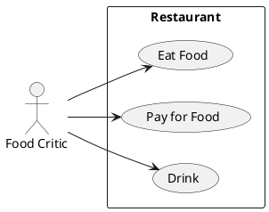

# Описание требований и архитектуры

## Введение
<!-- Общее краткое описание создаваемой системы -->
В рамках курса осуществляется проектирование решения на основе [постановки задачи от "заказчика"](../../task.md).

- [Описание требований и архитектуры](#описание-требований-и-архитектуры)
  - [Введение](#введение)
  - [Заинтересованные стороны](#заинтересованные-стороны)
  - [Бизнес-контекст (бизнес-требования)](#бизнес-контекст-бизнес-требования)
  - [Глоссарий](#глоссарий)
  - [Модель предметной области](#модель-предметной-области)
  - [Требования к системе](#требования-к-системе)
    - [Сценарии использования (Use case)](#сценарии-использования-use-case)
    - [Функциональные требования](#функциональные-требования)
    - [Бизнес-метрики](#бизнес-метрики)
    - [Нефункциональные требования/Требования к атрибутам качества](#нефункциональные-требованиятребования-к-атрибутам-качества)
    - [Ограничения](#ограничения)
  - [Архитектура](#архитектура)
    - [Журнал архитектурных решений](#журнал-архитектурных-решений)
    - [Контекст решения](#контекст-решения)
    - [Компонентная архитектура](#компонентная-архитектура)
    - [Реализация сценариев использования](#реализация-сценариев-использования)
    - [Программные интерфейсы](#программные-интерфейсы)
    - [Схема развертывания](#схема-развертывания)
  
## Заинтересованные стороны
<!-- Перечень заинтересованных сторон и их интересов по отношению к создаваемой системе. 
Подробнее: https://confluence.mts.ru/pages/viewpage.action?pageId=399975538 
-->
| Заинтересованная сторона      | Интересы                                           |
|:------------------------------|:---------------------------------------------------|
| *Руководитель компании*       | *Повышение узнаваемости бренда*                    |
| *Руководитель HR*             | *Развитие HR-бренда*                               |
| *Докладчики*                  | *Регистрация и получения рецензий*                 |
| *Члены программного комитета* | *Удобная работа с докладами*                       |
| *Посетители конференции*      | *Простота регистрации, выбора и просмотра доклада* |

## Бизнес-контекст (бизнес-требования)
<!-- Общее описание бизнес-контекста создаваемой системы (автоматизируемой деятельности), список бизнес-целей заинтересованных сторон 
Подробнее: https://confluence.mts.ru/pages/viewpage.action?pageId=399973845
-->
Система должна обеспечивать автоматизацию работ по подготовке и проведению онлайн-конференции.

## Глоссарий
<!-- Содержит основные понятия и термины предметной области  
Подробнее: https://confluence.mts.ru/pages/viewpage.action?pageId=375782595
-->
| Понятие                      | Сокращение | Определение                                                          |
|:-----------------------------|:-----------|:---------------------------------------------------------------------|
| *Доклад*                     |            | *Выступление, совершаемое Докладчиком. Сопровождается Презентацией.* |
| *Презентация*                |            | *Слайды.*                                                            |
| *Докладчик*                  |            | *Специалист, выступающий с докладом.*                                |
| *Посетитель*                 |            | *Человек, смотрящий доклады. Основной пользователь системы.*         |
| *Член программного комитета* | *Член ПК*  | *Специалист, отбирающий доклады и оставляющий на них отзывы.*        |
| *Конференция*                |            | *Периодическое онлайн-мероприятие со своим номером.*                 |

## [Модель предметной области](data/data.md)

## Требования к системе

### Сценарии использования (Use case)
<!-- Подробное описание сценариев использования системы с привязкой к ролям участников и задействованным бизнес-сущностям 
https://confluence.mts.ru/pages/viewpage.action?pageId=375782108 
https://confluence.mts.ru/pages/viewpage.action?pageId=375782119 
-->
#### Диаграмма сценариев использования (Use Case Diagram) <!-- omit in toc -->

#### Список сценариев использования <!-- omit in toc -->

| ID     | Описание                                          |
|--------|---------------------------------------------------|
| UC.001 | *[Подача доклада](uc/uc.001.md)* |
| UC.001 | *[Согласование доклада](uc/uc.001.md)* |
| UC.001 | *[Формирование расписания докладов](uc/uc.001.md)* |
| UC.001 | *[Проведение доклада](uc/uc.001.md)* |
| UC.001 | *[Просмотр доклада](uc/uc.001.md)* |
| UC.001 | *[Написание отзыва](uc/uc.001.md)* |
| UC.001 | *[Название сценария использования](uc/uc.001.md)* |

### Функциональные требования
<!-- Описание требований к функциям, реализуемым системой. Требование может быть привязано к сценарию использования или быть общим 
Подробнее: https://confluence.mts.ru/pages/viewpage.action?pageId=375782501 
-->
| ID     | Функциональное требование                                                     |
|--------|-------------------------------------------------------------------------------|
| FR.001 | *Система должна обеспечивать подачу заявок на участие в качестве докладчика.* |
| FR.002 | *Система должна обеспечивать подтверждение либо отказ заявки*                 |
| FR.003 | *Система должна предоставлять средства рецензирования доклада*                |
| FR.004 | *Система должна обеспечивать регистрацию посетителей*                         |
| FR.005 | *Система должна обеспечивать отображение расписания докладов*                 |
| FR.006 | *Система должна обеспечивать возможность смотреть доклады*                    |
| FR.007 | *Система должна обеспечивать доступ к докладам прошедших конференций*         |

### Бизнес-метрики
| ID     | Описание метрики                            |
|--------|---------------------------------------------|
| BM.001 | *Количество зарегистрированных зрителей конференции - до 5000* |
| BM.002 | *Количество заявок на доклад - 100* |
| BM.003 | *Время согласования доклада - 60 дней* |
| BM.004 | *Количество отзывов, оставленных зрителями - 50%* |
| BM.005 | *Время ожидания уведомления с подтверждением регистрации - до 10 секунд* |

### Нефункциональные требования/Требования к атрибутам качества
<!-- Требования к основным архитектурным характеристикам (атрибутам качества) системы - надежность, масштабируемость, ИБ, и др.
Подробнее: https://confluence.mts.ru/pages/viewpage.action?pageId=375782530 
-->
| ID     | Атрибут качества             | Описание требования                       | Алгоритм проверки                         |
|--------|------------------------------|-------------------------------------------|-------------------------------------------|
| PRF.001 | *Количество регистраций в секунду* | *Требуется обеспечить 100 регистраций посетитетей в секунду* | Периодическое проведение нагрузочного тестирования  |
| PRF.002 | *Количество read-запросов секунду* | *Требуется обеспечить 1000 RPS (запрос расписания)* | Периодическое проведение нагрузочного тестирования|
| REL.001 | *Надёжность* | *Требуется обеспечить 99.9% успешных обращений* | Замер времени недоступности сервиса в течение года |
| SEC.004 | *Аутентификация через WebSSO* | *Требуется обеспечить аутентификацию пользователей через WebSSO* | Тестирование силами QA |
| SEC.005 | *Ролевое разграничение* | *Требуется обеспечить разграничение прав доступа пользователей на основе ролей* | Тестирование силами QA |
| OBS.006 | *Централизованное хранилище логов* | *Требуется обеспечить хранение логов в Платформе наблюдаемости* | Периодическая проверка наличия свежих логов в OBS |
| OBS.007 | *Хранение логов за 14 дней* | *Требуется обеспечить хранение логов за период не менее 14 последних дней* | Периодическая проверка даты самых старых логов в OBS |

### Ограничения
<!-- Описываются ограничения, оказывающие влияние на архитектуру системы - временные, финансовые, технологические
Подробнее: https://confluence.mts.ru/pages/viewpage.action?pageId=375782592
-->
| ID     | Ограничение            |
|--------|------------------------|
| AC.001 | *Описание ограничения* |

## Архитектура

### Журнал архитектурных решений
<!-- Записи о ключевых принятых архитектурных решениях (ADR) для реализации архитектурно-значимых требований.
Подробнее: https://confluence.mts.ru/pages/viewpage.action?pageId=421162308
-->
- [ADR.NNN Суть решения](adr/adr-template.md)

### [Контекст решения](context/context.md)

### [Компонентная архитектура](components/components.md)

### Реализация сценариев использования
<!-- Реализация сценариев использования на основе взаимодействия компонентов системы и внешних систем/участников.
Диаграммы последовательности (UML Sequence diagram) и текстовое описание.

Подробнее: 
https://confluence.mts.ru/pages/viewpage.action?pageId=399442132
https://confluence.mts.ru/pages/viewpage.action?pageId=399442170
-->
| ID     | Описание                          | Реализация                                    |
|--------|-----------------------------------|-----------------------------------------------|
| UC.001 | *Название сценария использования* | [Реализация сценария](uc-impl/uc.001-impl.md) |

### Программные интерфейсы
<!-- Спецификации публичных API системы и ее компонентов (синхронных, событийных). Создается на основе модели предметной области для реализации сценариев использования. 
  Форматы: OAS/Swagger, GraphQL, AsyncAPI/CloudEvents
-->
| Компонент             | Интерфейс                                      |
|:----------------------|:-----------------------------------------------|
| *Название компонента* | *[Название интерфейса](api/service-name.yaml)* |

### [Схема развертывания](deployment/deployment.md)
