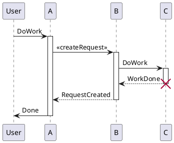

# UC.001 Название сценария использования
<!-- Реализация сценариев использования на основе взаимодействия компонентов системы и внешних систем/участников.
Диаграммы последовательности (UML Sequence diagram) и текстовое описание.

Подробнее: 
https://confluence.mts.ru/pages/viewpage.action?pageId=399442132
https://confluence.mts.ru/pages/viewpage.action?pageId=399442170
-->
Реализация сценария использования.

