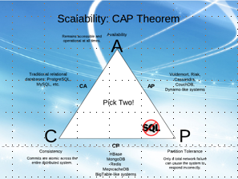

## К каким системам по CAP теореме относятся перечисленные БД и почему

MongoDB, MSSQL, Cassandra.
ДЗ сдается ссылкой на гит, где расположен миниотчет в маркдауне.

---
<code></code>

## MongoDB

Принцип работы: Master Slave(один или несколько). Если Slave не доступен, то запрещаем запись и ждем пока система не востановится, но разрешаем читать.

### CAP

* Система содержит всегда консистемнтные данны. Запись идет через Master. Автоматическая смена master при его утери. Буква "С".
* Система при разделении останавливает запись, но доступна для чтения. Это буква "P", тоесть устойчива к разделению.
* Система не доступна пока разделена. Не "А".

**Итого система класса CP.**  

 

### PACELC

**Система класса PA/EC** (при настройке по умолчанию)

* Поскольку вся репликация выполняется асинхронно (от первичного к вторичному), когда есть сетевой раздел P, в котором первичный потерян или становится изолированным на стороне меньшинства, существует вероятность потери данных. Доступность A, а не консистентность.
* В нормальном состоянии E, отдаем предпочтение консистентности C.

**Система класса PС/EC** (при настройке  для записи на большинство реплик и чтения с основного)

---

## MSSQL

### CAP

* Система при разделении не доступна  -  не P
* ACID - важна консистентность и доступность. C

**Итого система класса CA.**\
_как и все распределенные базы_

### PACELC

* ACID система.
* При разделении P , жертвуем А в угоду С
* Без разделения E, жертвуем L в угоду С

**Итого система класса PС/EC.**

---

## Cassandra

### CAP

* база данных NoSQL
* использует схему репликации master-master, что значит, все узлы остаются доступными А
* разделение сети приводит к самодостаточному функционированию всех узлов P

**Итого система класса AP.**

### PACELC

Предпочитает доступность согласованности при возникновении раздела; в противном случае выбирает меньшую задержку.

* При разделении P , жертвуем C в угоду A
* Без разделения E, жертвуем C в угоду L

**Итого система класса PA/EL.**
